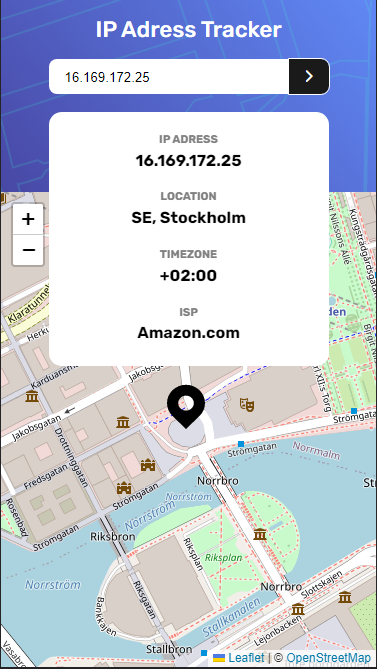

# Frontend Mentor - IP address tracker solution

This is a solution to the [IP address tracker challenge on Frontend Mentor](https://www.frontendmentor.io/challenges/ip-address-tracker-I8-0yYAH0).

## Table of contents

- [Overview](#overview)
  - [The challenge](#the-challenge)
  - [Screenshot](#screenshot)
  - [Links](#links)
- [Author](#author)

## Overview

### The challenge

Users should be able to:
- View the optimal layout depending on their device's screen size
- See their own IP address on the map on the initial page load
- Search for any IP addresses and see the key information and location

### Screenshot

### Links

- GitHub repository: [https://github.com/WersV/ip-adress-tracker](https://github.com/WersV/ip-adress-tracker)
- GitHub Pages: [https://wersv.github.io/ip-adress-tracker/](https://wersv.github.io/ip-adress-tracker/)

## Author

- My GitHub profile - [Przemysław Botwina(WersV)](https://github.com/WersV)
